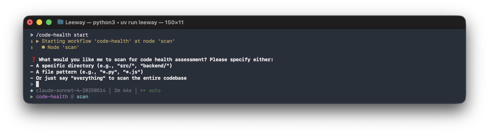
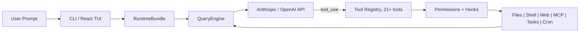
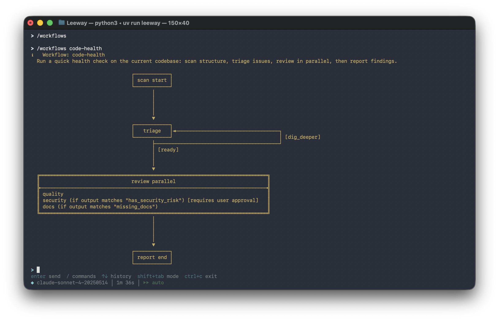
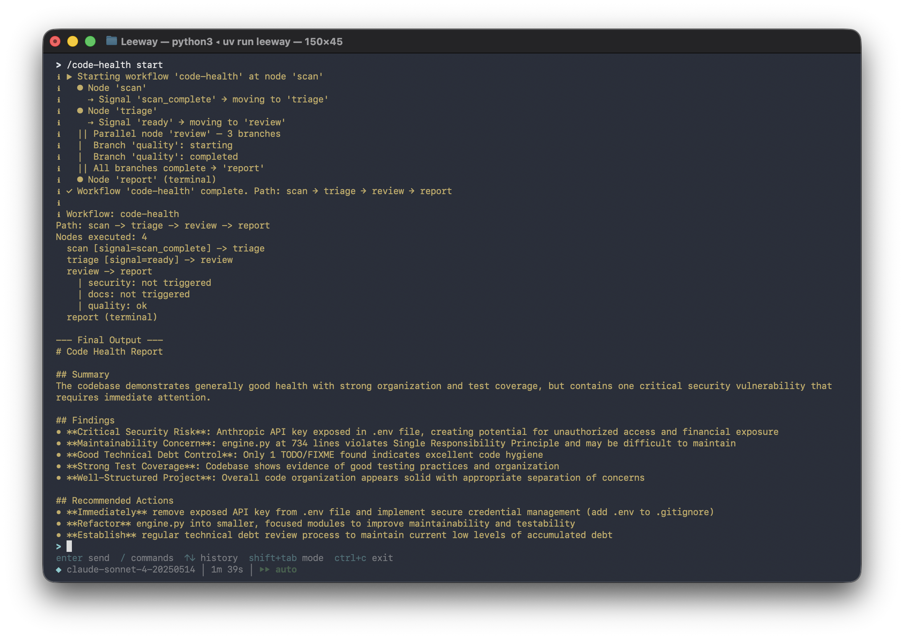

<p align="center" style="margin-bottom: 0;">
  
</p>

<h1 align="center" style="margin-top: 0;">Leeway</h1>

<p align="center">
  <strong>Human-defined workflows. AI-powered execution.</strong><br>
  YAML decision trees with scheduling, hooks, MCP, and 21 built-in tools.
</p>

<p align="center">
  <a href="#-quick-start"></a>
  <a href="docs/workflows.md"></a>
  <a href="docs/tools.md"></a>
  <a href="LICENSE"></a>
</p>

<p align="center">
  
  
  
</p>

<p align="center">
  
</p>

---

## Why Leeway?

**You want to automate the same multi-step task. A skill or system prompt can guide the agent, but it can't pin the order: every run reads different files, uses different tools, reaches different conclusions. Nothing you can repeat, nothing you can audit.**

Leeway enforces the graph. You write a YAML decision tree; the same nodes run in the same order every time. Each node picks its own tools and runs a full agent loop: the LLM iterates and emits a `workflow_signal` when done. The graph transitions on those signals.

### Tools comparison

|  | Who drives the flow? | What's in a node? | Best for |
|---|---|---|---|
| **AutoGPT, OpenClaw** | LLM | Whatever the LLM decides | Exploratory tasks |
| **n8n** | Graph | Any kind of node (API call, transform, AI Agent subflow) | Connecting SaaS APIs (Slack, Stripe, Airtable) |
| **Leeway** | Graph (decisions) | A full agent loop with local-dev tools | Personal workflows and custom engineering pipelines that plug into your own system (files, shell, codebase) |

n8n is incredible for connecting SaaS APIs. **Leeway is built specifically for personal workflows and custom engineering pipelines that integrate directly into your own system: your files, your shell, your repo, not third-party webhooks.**

> **Pick Leeway when** the task runs on your own files or shell, needs to be repeatable, and needs a model that can reason inside each step.

---

## Key Features

Five things that are hard to get from a node-graph workflow tool:

| # | Feature | What it does |
|---|---------|--------------|
| 1 | **Agent loop per node** | Each node is a full agent loop. The model can call `read_file`, `grep`, `bash`, iterate up to `max_turns`, and emit a `workflow_signal` when done. You decide the graph; the model decides the steps within each node. |
| 2 | **Per-node scoping** | Every node gets its own `ToolRegistry`, `SkillRegistry`, `HookRegistry`, and MCP set, merged from globals and the node's allowlist. Node A can have `bash` + `glob`; node B can have `web_fetch` + `mcp_github_search`; same workflow. |
| 3 | **Progressive skill loading, per node** | `skill(name="code-review")` returns `SKILL.md` plus a file index. Reference files load only when the LLM explicitly asks. Combined with per-node scoping, each node only sees its allowlisted skills, and only their top-level content until the model drills in. |
| 4 | **Turn budget with urgency injection** | For signal-based nodes, the engine tells the LLM how many turns it has and injects an *urgent reminder* at 2 turns remaining, listing the exact signals to call. No silent cost runaway. |
| 5 | **Auto-compaction (microcompact + LLM summary)** | When context fills, Leeway first clears stale tool-result bodies in place. If that's not enough, it summarizes older messages via LLM while preserving the last 6. Fully transparent: no manual `/compact`, no lost context mid-workflow. |

### Signal validation

At every branching node, the model picks which path the workflow should take next. The obvious concern: what if it picks a path that doesn't exist? Leeway catches this at the runtime layer, not via prompt discipline:

- **Each node declares its allowed choices up front**, as part of the node's outgoing paths. No global list, no free-form routing. An `assess` node might allow only `needs_investigation` or `well_documented`; the same label on a different node can mean something completely different.
- **The model's decision tool only accepts those choices.** If it picks anything else, the tool call returns an error listing the valid options, and the model tries again. Typos and made-up names fail fast instead of quietly leading the workflow down the wrong branch.
- **A legal choice with no matching path halts the run.** If the model picks an option that's valid in theory but no real path is wired up for it, the engine stops and logs it rather than drifting.

This does not stop the model from confidently picking a *legal but wrong* option. What the graph gives you in that case is bounded damage: the wrong branch still runs inside its own restricted tool set and validated inputs, and the whole path is auditable after the fact.

See [docs/workflows.md](docs/workflows.md#runtime-behavior) for the full mechanics.

---

## Quick Start

### Prerequisites

- **Python 3.10+** and [uv](https://docs.astral.sh/uv/)
- **Node.js 18+** (optional, for the React terminal UI)
- An LLM API key

### Install & Run

```bash
# Clone and install
git clone https://github.com/your-org/Leeway.git
cd Leeway
uv sync --extra dev

# Set your API key
export ANTHROPIC_API_KEY=sk-...

# Launch interactive mode
uv run leeway

# Or run a single prompt
uv run leeway -p "explain this codebase"

# Use different models
uv run leeway --model claude-opus-4-6

# Use OpenAI-compatible provider
uv run leeway --api-format openai --base-url https://api.openai.com/v1
```

### Try the Example Workflow

```bash
# Health check on any codebase. No input needed, low token usage
uv run leeway
> /code-health start
```

<p align="center">
  
</p>

---

## Architecture

Leeway's core agent loop, tool registry, permission system, and hook lifecycle are inspired by **Claude Code's architecture**: a minimal, streaming-first loop where the model drives tool use and the host enforces safety around it. Leeway reimplements that design in Python and extends it with a YAML workflow layer, parallel branches, cron scheduling, and per-node scoping.



The **human** defines the graph. The **AI** operates within each node. **Deterministic transitions** connect them. **Parallel branches** run concurrently with per-branch scoping and human-in-the-loop approval gates.

---

## Example Workflow

See [`.leeway/workflows/code-health.yaml`](.leeway/workflows/code-health.yaml). It covers all five patterns (linear, branch, loop, terminal, parallel) in one workflow with skills, hooks, and approval gates.

```
> /workflows
```

<p align="center">
  
</p>

### Workflow Progress

<p align="center">
  
</p>

See **[docs/workflows.md](docs/workflows.md)** for the full pattern catalog and every property table.

---

## Learn More

| Topic | Docs |
|---|---|
| Writing workflows (patterns, properties, transitions) | [docs/workflows.md](docs/workflows.md) |
| Built-in tools and custom tool authoring | [docs/tools.md](docs/tools.md) |
| Skills with progressive disclosure | [docs/skills.md](docs/skills.md) |
| Hooks (command + HTTP lifecycle callbacks) | [docs/hooks.md](docs/hooks.md) |
| MCP server integration | [docs/mcp.md](docs/mcp.md) |
| Plugins (distributable bundles) | [docs/plugins.md](docs/plugins.md) |
| Scheduling, cron, and remote triggers | [docs/scheduling.md](docs/scheduling.md) |
| Permission modes and path rules | [docs/permissions.md](docs/permissions.md) |
| Slash command reference | [docs/commands.md](docs/commands.md) |

---

## License

MIT
