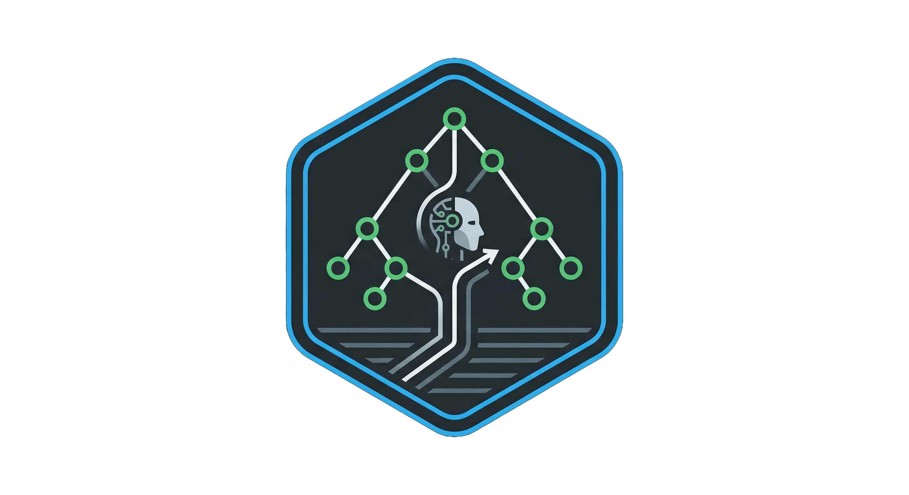
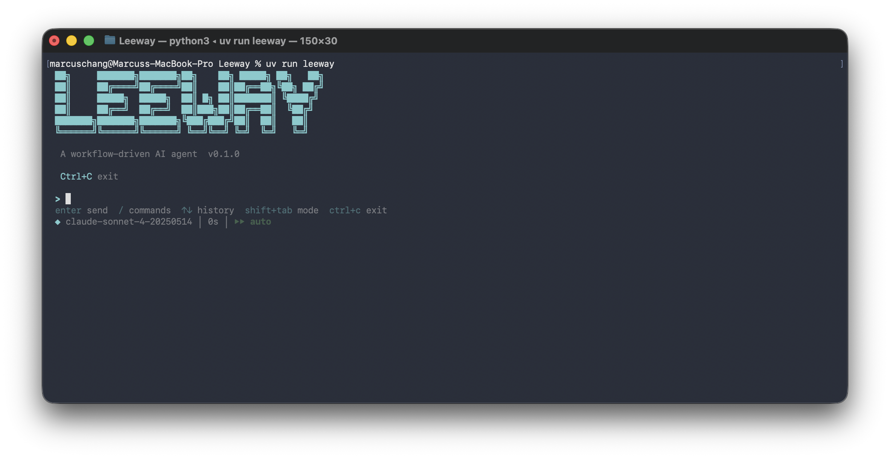
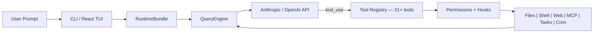

<p align="center">
  <br>
  <strong style="font-size:2em;">Leeway</strong>
</p>

<p align="center">
  <strong>Human-defined workflows. AI-powered execution.</strong><br>
  YAML decision trees with scheduling, hooks, MCP, and 21 built-in tools.
</p>

<p align="center">
  <a href="#-quick-start"></a>
  <a href="#-writing-workflows"></a>
  <a href="#-tools-21"></a>
  <a href="#-test-results"></a>
  <a href="LICENSE"></a>
</p>

<p align="center">
  
  
  
</p>

---

## Why Leeway?

Most AI agent tools fall into two extremes:

| | Agent-controlled (e.g. OpenClaw) | Human-designed (e.g. n8n) | **Leeway** |
|---|---|---|---|
| **Who decides the flow?** | The AI | The human | **Human** (YAML decision trees) |
| **Who executes steps?** | The AI | Rigid scripts | **AI** (flexible within each node) |
| **Predictable?** | No — might do anything | Yes — but no AI flexibility | **Yes** — deterministic transitions |
| **Flexible?** | Yes — but unpredictable | No — locked to the design | **Yes** — AI reasons within bounds |

**Leeway** gives you the reliability of a state machine with the flexibility of an LLM at each step.

---

## Key Features

<table align="center" width="100%">
<tr>
<td width="20%" align="center" style="vertical-align: top; padding: 15px;">

<h3>Workflow Engine</h3>

<p align="center"><strong>YAML Decision Trees</strong></p>
<p align="center">Signal-based transitions</p>
<p align="center">Branch, merge, loop</p>
<p align="center">Parallel execution</p>
<p align="center">Per-node scoping</p>

</td>
<td width="20%" align="center" style="vertical-align: top; padding: 15px;">

<h3>Scheduling</h3>

<p align="center"><strong>Cron Daemon</strong></p>
<p align="center">Cron & intervals</p>
<p align="center">Background tasks</p>
<p align="center">Webhook triggers</p>
<p align="center">One-shot timers</p>

</td>
<td width="20%" align="center" style="vertical-align: top; padding: 15px;">

<h3>21+ Tools</h3>

<p align="center"><strong>File, Shell, Web, MCP</strong></p>
<p align="center">On-demand skills</p>
<p align="center">Plugin ecosystem</p>
<p align="center">Persistent memory</p>
<p align="center">Subagent spawning</p>

</td>
<td width="20%" align="center" style="vertical-align: top; padding: 15px;">

<h3>Extensibility</h3>

<p align="center"><strong>Hooks & MCP</strong></p>
<p align="center">Before/after hooks</p>
<p align="center">MCP integration</p>
<p align="center">Plugin bundles</p>
<p align="center">Custom tools</p>

</td>
<td width="20%" align="center" style="vertical-align: top; padding: 15px;">

<h3>Governance</h3>

<p align="center"><strong>Permissions</strong></p>
<p align="center">Path & command rules</p>
<p align="center">Human-in-the-loop</p>
<p align="center">Plan mode (read-only)</p>
<p align="center">Multi-provider support</p>

</td>
</tr>
</table>

---

## Quick Start

### Prerequisites

- **Python 3.10+** and [uv](https://docs.astral.sh/uv/)
- **Node.js 18+** (optional, for the React terminal UI)
- An LLM API key

### Install & Run

```bash
# Clone and install
git clone https://github.com/your-org/Leeway.git
cd Leeway
uv sync --extra dev

# Set your API key
export ANTHROPIC_API_KEY=sk-...

# Launch interactive mode
uv run leeway

# Or run a single prompt
uv run leeway -p "explain this codebase"

# Use different models
uv run leeway --model claude-opus-4-6

# Use OpenAI-compatible provider
uv run leeway --api-format openai --base-url https://api.openai.com/v1
```

<p align="center">
  
</p>

### Try the Example Workflow

```bash
# Health check on any codebase — no input needed, low token usage
uv run leeway
> /code-health start
```

---

## Architecture



### The Agent Loop

```python
while True:
    response = await api.stream(messages, tools)
    
    if response.stop_reason != "tool_use":
        break  # Model is done
    
    for tool_call in response.tool_uses:
        # Hook(before) → Permission check → Execute → Hook(after)
        result = await execute_tool(tool_call)
    
    messages.append(tool_results)
    # Loop continues — model sees results, decides next action
```

### Workflow Execution

```
User YAML ──► WorkflowEngine ──► Node 1 (scoped tools/skills/hooks)
                                    │
                                    ▼ signal / pattern / tool match
                                 Node 2 (parallel?)
                                    │
                           ┌────────┼────────┐
                           ▼        ▼        ▼    concurrent branches
                        Branch A  Branch B  Branch C
                           └────────┼────────┘
                                    ▼ all branches complete
                                 Node 3 ──► Terminal Node
                                    │
                                    ▼ audit trail + progress events
                                 Result
```

The **human** defines the graph. The **AI** operates within each node. **Deterministic transitions** connect them. **Parallel branches** run concurrently with per-branch scoping and human-in-the-loop approval gates.

---

## Writing Workflows

Place YAML files in `~/.leeway/workflows/` or `<project>/.leeway/workflows/`. They are automatically discovered.

### Five Patterns

**Linear** — unconditional transition:
```yaml
scan:
  prompt: "Scan the project structure."
  tools: [glob, bash]
  edges:
    - target: assess
      when: { always: true }
```

**Branch** — signal-based split:
```yaml
assess:
  prompt: "Signal 'well_documented', 'needs_investigation', or 'trivial'."
  edges:
    - target: deep_dive
      when: { signal: needs_investigation }
    - target: summarize
      when: { signal: well_documented }
```

**Loop** — back-edge to self or earlier node:
```yaml
deep_dive:
  prompt: "Read key files. Signal 'dig_deeper' to loop, 'enough' to move on."
  tools: [read_file, grep, glob]
  edges:
    - target: deep_dive
      when: { signal: dig_deeper }
    - target: summarize
      when: { signal: enough }
```

**Terminal** — no edges, workflow ends:
```yaml
summarize:
  prompt: "Write a summary with ## Overview, ## Key Files, ## Architecture."
```

**Parallel** — condition-based concurrent branches:
```yaml
review:
  parallel:
    branches:
      quality:
        when: { always: true }
        prompt: "Review code quality"
        tools: [grep, glob]
        skills: [code_review]
      security:
        when: { signal: security_risk }
        prompt: "Security audit"
        tools: [grep, web_fetch]
        requires_approval: true
      tests:
        when: { signal: has_tests }
        prompt: "Run tests"
        tools: [bash]
    timeout: 300
  edges:
    - target: report
      when: { always: true }
```

All matching branches run concurrently. All triggered branches must complete before transitioning. Branches with `requires_approval: true` ask the user first.

### Full Example

See [`.leeway/workflows/code-health.yaml`](.leeway/workflows/code-health.yaml) — all five patterns in one workflow with skills, hooks, and approval gates:

```
    ┌────────────┐
    │ scan start │    linear, auto
    └────────────┘
           │
           ▼
     ┌──────────┐
     │  triage  │◄──┐ [dig_deeper]
     └──────────┘   │
           ├────────┘
           │ [ready]
           ▼
╔═══════════════════════════════════╗
║       review (parallel)           ║
╠═══════════════════════════════════╣
║ quality | security* | docs        ║
╚═══════════════════════════════════╝
           │
           ▼
    ┌─────────────┐
    │ report end  │
    └─────────────┘
```

### Workflow Properties

Top-level fields in the YAML file:

| Property | Default | Description |
|----------|---------|-------------|
| `name` | required | Workflow identifier (used in commands and logs) |
| `description` | `""` | Human-readable description of the workflow |
| `start_node` | required | Name of the first node to execute |
| `nodes` | required | Dictionary mapping node names to node definitions |
| `global_tools` | `[]` | Tools available in every node (merged with per-node tools) |
| `global_skills` | `[]` | Skills available in every node (merged with per-node skills) |
| `global_hooks` | `[]` | Hooks active in every node (merged with per-node hooks) |
| `global_mcp_servers` | `[]` | MCP servers available in every node (merged with per-node MCP servers) |

### Node Properties

| Property | Default | Description |
|----------|---------|-------------|
| `prompt` | required | Task instructions for the LLM at this step |
| `tools` | `[]` | Tool whitelist (only these tools are available) |
| `max_turns` | `50` | Max LLM turns within this node |
| `carry_context` | `true` | Pass prior node's summary as context |
| `interactive` | `true` | When `true`, the agent can use `ask_user_question` and permission prompts are shown. When `false`, the node runs fully automatically — user prompts are suppressed and parallel approval gates are auto-approved |
| `edges` | `[]` | Outgoing transitions (empty = terminal node) |
| `skills` | `[]` | Skill names scoped to this node |
| `hooks` | `[]` | Node-specific hook definitions |
| `mcp_servers` | `[]` | MCP server names scoped to this node |
| `parallel` | `null` | Parallel execution spec (branches, timeout) |

### Transition Conditions

| Condition | Description |
|-----------|-------------|
| `signal: <value>` | LLM called `workflow_signal` with this decision |
| `output_matches: <regex>` | LLM's final text matches the pattern |
| `tool_was_called: <name>` | A specific tool was used during the node |
| `always: true` | Unconditional transition |

All conditions support `negate: true` to invert the match.

**Turn-budget awareness:** For nodes with signal-based edges, the engine automatically tells the LLM how many turns it has and injects an urgent reminder when 2 turns remain. This prevents the LLM from exhausting its turn budget on investigation without signalling a decision.

### Edge Properties

| Property | Default | Description |
|----------|---------|-------------|
| `target` | required | Name of the destination node |
| `when` | `always` | Transition condition (see table above) |
| `priority` | `0` | Evaluation order — higher priority edges are checked first |

### Branch Properties

Each branch inside a `parallel` block supports:

| Property | Default | Description |
|----------|---------|-------------|
| `when` | `always` | Condition that triggers this branch |
| `prompt` | required | Branch-specific task instructions |
| `tools` | `[]` | Tool whitelist for this branch |
| `max_turns` | `50` | Max LLM turns within this branch |
| `skills` | `[]` | Skill names scoped to this branch |
| `hooks` | `[]` | Branch-scoped hook definitions |
| `mcp_servers` | `[]` | MCP server names scoped to this branch |
| `requires_approval` | `false` | Human-in-the-loop gate — ask user before executing |

The `parallel` block itself also accepts a `timeout` (default `600` seconds) for how long to wait for all triggered branches to complete.

### Workflow Progress

```
▶ Starting workflow 'code-health' at node 'scan'
  ● Node 'scan'
    ⇢ Transition → 'triage'
  ● Node 'triage'
    ⇢ Signal 'ready' → moving to 'review'
  || Parallel node 'review' — 3 branches
  |  Branch 'quality': starting
  |  Branch 'security': approved
  |  Branch 'security': starting
  |  Branch 'docs': starting
  |  Branch 'quality': completed
  |  Branch 'docs': completed
  |  Branch 'security': completed
  || All branches complete → 'report'
  ● Node 'report' (terminal)

✓ Workflow 'code-health' complete. Path: scan → triage → review → report
```

---

## Tools (21+)

| Category | Tools | Description |
|----------|-------|-------------|
| **File I/O** | `bash`, `read_file`, `write_file`, `edit_file`, `glob`, `grep` | Core file operations with permission checks |
| **Web** | `web_fetch`, `web_search` | HTTP content retrieval and Brave search |
| **Interaction** | `ask_user_question`, `skill` | User input and on-demand knowledge loading |
| **Tasks** | `task_create`, `task_list`, `task_get`, `task_stop` | Background task lifecycle management |
| **Scheduling** | `cron_create`, `cron_list`, `cron_delete`, `cron_toggle` | Cron job management |
| **Agents** | `agent`, `remote_trigger` | Subagent spawning and webhook triggers |
| **Memory** | `memory_read`, `memory_write` | Persistent cross-session knowledge |
| **MCP** | `mcp_<server>_<tool>` (dynamic) | Auto-registered from MCP servers |

Every tool has **Pydantic input validation**, **self-describing JSON Schema**, **permission integration**, and **hook support**.

---

## Scheduling & Cron

Leeway includes a standalone cron scheduler daemon for running workflows and commands on a schedule.

```bash
# Start the scheduler daemon
uv run leeway scheduler start

# Check status
uv run leeway scheduler status

# Stop
uv run leeway scheduler stop
```

**Schedule types:**

| Type | Example | Description |
|------|---------|-------------|
| Cron expression | `*/5 * * * *` | Every 5 minutes |
| Interval | `300` seconds | Every 5 minutes |
| One-shot | `2026-04-15T09:00:00` | Run once at a specific time |

**Action types:** shell commands, workflow executions, or webhook calls.

---

## Skills

Skills are **folder-per-skill** packages with a `SKILL.md` entry point and optional supporting files for **progressive disclosure**. The agent loads the main instructions first, then reads detailed references on demand.

### Structure

```
.leeway/skills/
  code-review/
    SKILL.md              # main instructions (loaded first)
    references/
      checklist.md        # detailed checklist (loaded on demand)
  security-audit/
    SKILL.md              # main instructions
    references/
      owasp.md            # OWASP checklist (loaded on demand)
  coding-standards/
    SKILL.md              # main instructions
    references/
      python.md           # Python-specific conventions
      typescript.md       # TypeScript-specific conventions
```

This project includes 3 skills in [`.leeway/skills/`](.leeway/skills/):

| Skill | Description | References | Used by |
|-------|-------------|------------|---------|
| [`coding-standards`](.leeway/skills/coding-standards/SKILL.md) | Coding standards checklist | `references/python.md`, `references/typescript.md` | Global (all nodes) |
| [`code-review`](.leeway/skills/code-review/SKILL.md) | Quality review patterns | `references/checklist.md` | `quality` branch |
| [`security-audit`](.leeway/skills/security-audit/SKILL.md) | Security vulnerability audit | `references/owasp.md` | `security` branch |

### How Progressive Disclosure Works

1. Agent calls `skill(name="code-review")` → gets SKILL.md content + list of reference files
2. SKILL.md says *"For the full checklist, read references/checklist.md"*
3. Agent calls `skill(name="code-review", file="references/checklist.md")` → gets detailed checklist
4. Only the content needed right now is loaded into context

### SKILL.md Format

```markdown
---
name: code-review
description: Code quality review — identify patterns, anti-patterns, and improvements. Use when performing code reviews, auditing code quality, or evaluating pull requests.
---

# Code Review

## Workflow

1. Scan structure — use `glob` and `grep` to understand the scope of changes
...

For the full quality checklist, read [references/checklist.md](references/checklist.md).
```

The `description` field is the primary trigger — include both what the skill does and when to use it. Supporting files go in `references/`, `scripts/`, or `assets/` subdirectories.

### Scoping

Skills can be scoped per-node or per-branch in workflows:
```yaml
global_skills: [coding-standards]     # available in every node

nodes:
  review:
    parallel:
      branches:
        quality:
          skills: [code-review]       # only this branch gets code-review
```

Place in `~/.leeway/skills/` or `<project>/.leeway/skills/`. Legacy flat `.md` files are also supported. List with `/skills`, load via the `skill` tool.

---

## Hooks

Lifecycle callbacks that fire before or after tool execution. Hooks can be defined globally (in `settings.json`), at the workflow level (`global_hooks`), or per-node/branch:

```yaml
# Workflow-level hooks (fire for all nodes)
global_hooks:
  - type: command
    match: { event: workflow_start }
    command: "echo 'workflow started' >> /tmp/hooks.log"

nodes:
  tests:
    hooks:   # Node-level hook (only fires within this node)
      - type: command
        match: { event: after_tool_use, tool_name: bash }
        command: "echo 'bash executed in tests' >> /tmp/hooks.log"
```

Settings-level hooks in `settings.json`:
```json
{
  "hooks": [
    {
      "type": "http",
      "match": { "event": "before_tool_use" },
      "url": "https://example.com/webhook",
      "method": "POST"
    }
  ]
}
```

| Hook Type | Execution | Use Case |
|-----------|-----------|----------|
| `command` | Shell command with payload on stdin | Logging, notifications, auditing |
| `http` | HTTP POST with JSON payload | External integrations, webhooks |

Hooks are merged from all levels: settings → workflow globals → node/branch. Errors are logged but never block execution.

---

## MCP Support

Connect to [Model Context Protocol](https://modelcontextprotocol.io/) servers for external tool integration:

```json
{
  "mcp_servers": [
    {
      "name": "my-server",
      "transport": "stdio",
      "command": "npx",
      "args": ["-y", "@my/mcp-server"]
    }
  ]
}
```

MCP tools auto-register as `mcp_<server>_<tool>` and are available in workflow node `tools:` lists.

```bash
uv pip install leeway[mcp]  # Install MCP support
```

---

## Plugins

Bundle skills, hooks, and MCP servers into distributable packages:

```
my-plugin/
  plugin.json
  skills/
    review.md
```

```json
{
  "name": "my-plugin",
  "version": "1.0.0",
  "skills": ["skills/review.md"],
  "hooks": [],
  "mcp_servers": []
}
```

Place in `~/.leeway/plugins/<name>/` or `<project>/.leeway/plugins/<name>/`.

---

## Remote Triggers

Create webhook endpoints that trigger workflows from external systems:

```bash
# The agent creates triggers via the remote_trigger tool
# Each trigger gets a unique ID and secret

POST /trigger/<id>
Header: X-Trigger-Secret: <secret>
```

Use `remote_trigger` tool with `action: "create"` to set up a new endpoint.

---

## Permissions

Multi-level safety with fine-grained control:

| Mode | Behavior | Use Case |
|------|----------|----------|
| **Default** | Ask before write/execute | Daily development |
| **Full Auto** | Allow everything | Sandboxed environments |
| **Plan Mode** | Block all writes | Review before acting |

**Path-level rules** in `settings.json`:
```json
{
  "permission": {
    "mode": "default",
    "path_rules": [{ "pattern": "/etc/*", "allow": false }],
    "denied_commands": ["rm -rf /"]
  }
}
```

---

## Commands

| Command | Description |
|---------|-------------|
| `/help` | Show all available commands |
| `/workflows` | Browse workflows (interactive picker) |
| `/workflows <name>` | Show workflow graph |
| `/<name> <context>` | Run a workflow directly |
| `/skills` | List available skills |
| `/tasks` | List background tasks |
| `/cron` | List scheduled cron jobs |
| `/model` / `/model <name>` | Show or switch model |
| `/status` | Show session info |
| `/compact` | Compact conversation (reduce tokens) |
| `/permissions set <mode>` | Set permission mode |
| `/clear` | Clear conversation history |
| `/exit` | Exit the session |

---

## Extending Leeway

### Custom Tool

```python
from pydantic import BaseModel, Field
from leeway.tools.base import BaseTool, ToolExecutionContext, ToolResult

class MyToolInput(BaseModel):
    query: str = Field(description="Search query")

class MyTool(BaseTool):
    name = "my_tool"
    description = "Does something useful"
    input_model = MyToolInput

    async def execute(self, arguments: MyToolInput, context: ToolExecutionContext) -> ToolResult:
        return ToolResult(output=f"Result for: {arguments.query}")
```

### Custom Skill

Create `~/.leeway/skills/my-skill.md` with YAML frontmatter.

### Custom Plugin

Create `<project>/.leeway/plugins/my-plugin/plugin.json` with skills, hooks, and MCP servers.

---

## Test Results

| Suite | Tests | Status |
|-------|-------|--------|
| Skills (registry + tool + progressive disclosure) | 20 | All passing |
| Tasks (manager + store) | 9 | All passing |
| Hooks (registry + executor) | 7 | All passing |
| Cron (scheduler + store) | 8 | All passing |
| MCP (adapter) | 5 | All passing |
| Triggers (registry) | 3 | All passing |
| Agents (spawner) | 2 | All passing |
| Plugins (loader) | 4 | All passing |
| Memory (store) | 5 | All passing |
| Workflow (evaluator + graph + types) | 44 | All passing |
| Workflow (node scoping) | 8 | All passing |
| Workflow (parallel models) | 14 | All passing |
| Workflow (engine parallel) | 10 | All passing |
| Workflow (HITL broker) | 6 | All passing |
| Workflow (resource validation) | 12 | All passing |
| Workflow (graph: parallel + scoping) | 11 | All passing |
| Core (engine + permissions + tools) | 22 | All passing |
| **Total** | **190** | **All passing** |

```bash
uv run pytest -q  # Run all tests
```

---

## Project Structure

```
.leeway/               # Project-level configuration (auto-discovered)
  workflows/              # YAML workflow definitions
    code-health.yaml      # Example: zero-input codebase health check
  skills/                 # Folder-per-skill with progressive disclosure
    coding-standards/     # SKILL.md + references/python.md, typescript.md
    code-review/          # SKILL.md + references/checklist.md
    security-audit/       # SKILL.md + references/owasp.md

src/leeway/
  agents/       # Subagent spawning with worktree isolation
  api/          # LLM provider clients (Anthropic, OpenAI)
  config/       # Settings and path management
  cron/         # Cron scheduler daemon and job management
  engine/       # Core agent loop (query, messages, streaming)
  hooks/        # Lifecycle event hooks (command, HTTP)
  mcp/          # Model Context Protocol client integration
  memory/       # Persistent cross-session knowledge
  permissions/  # Permission checking system
  plugins/      # Plugin loader and manifest system
  prompts/      # System prompt builder
  services/     # Auto-compaction service
  skills/       # Skill registry and markdown parser
  state/        # Application state
  tasks/        # Background task manager
  tools/        # 21 built-in tools + base abstraction
  triggers/     # Webhook trigger server and registry
  ui/           # React TUI + backend host + print mode
  workflow/     # Decision tree engine, parallel branches, HITL, YAML parser
```

---

## License

MIT

